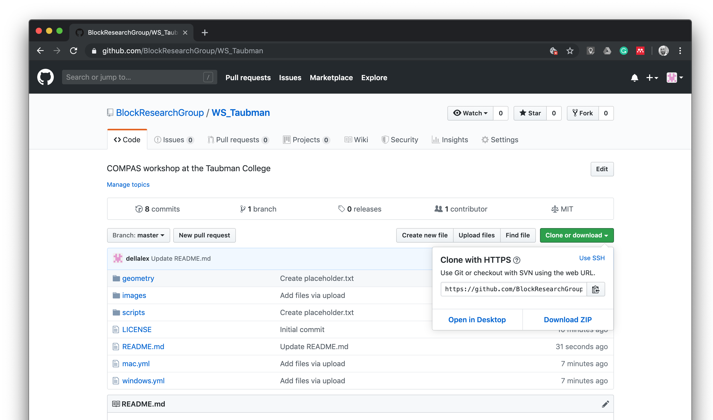
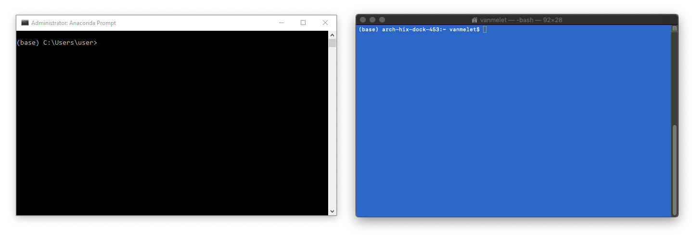

# COMPAS Workshop at the Taubman College 
University of Michigan
14 Oct 2019

In this workshop we will use COMPAS to generate and analyse discrete element assemblies. 

* https://github.com/compas-dev/compas
* https://compas-dev.github.io/main
* https://forum.compas-framework.org/

In addition to the main COMPAS package, we will use:

compas_assembly
* https://github.com/BlockResearchGroup/compas_assembly
* https://blockresearchgroup.github.io/compas_assembly/index.html

compas_rbe
* https://github.com/BlockResearchGroup/compas_rbe
* https://blockresearchgroup.github.io/compas_rbe/

## Preparations

**1. Clean up**

*   If you have an old version of Anaconda installed (for example Anaconda 2), please uninstall it.
*   If you have a version of Python registered on your `PATH`, please remove it (Windows only).

**2. Install required software**

*Note that this may take a while.*

*On Windows*

*   [Anaconda 3](https://www.anaconda.com/distribution/)
*   [Rhino](https://www.rhino3d.com/download)
*   [Sublime Text 3](https://www.sublimetext.com/3)
*   [Git](https://git-scm.com/downloads) (Windows only)
*   [Microsoft Visual C++ Compiler for Python 2.7](https://www.microsoft.com/en-us/download/details.aspx?id=44266) (Windows only)

During the installation of the various tools, just accept all default settings.
The default location for installing Anaconda is usually in the home directory.
If it isn't, try to install it there anyway.
And make sure not to register it on the `PATH` (Windows only).
On Windows, the path to the home directory is stored in the variable `%USERPROFILE%`.
On Mac, it is accessible through `~`.
This results in the following recommended installation directories for Anaconda.

```
%USERPROFILE%\Anaconda3
```

**If you are using Rhino 5 on Windows, you have to upgrade the built-in IronPython to version `2.7.5`.
Not to the newest version, but to this specific version.**
There are [detailed instructions](https://compas-dev.github.io/main/gettingstarted/cad/rhino5_windows.html)
in the COMPAS documentation that explain how to do this.

Instructions for configuring Sublime Text are also available in the COMPAS docs:
https://compas-dev.github.io/main/gettingstarted/editors/sublimetext.html

*On Mac*

*   [Anaconda 3](https://www.anaconda.com/distribution/)
*   [Rhino](https://www.rhino3d.com/download)
*   [Sublime Text 3](https://www.sublimetext.com/3)

During the installation of the various tools, just accept all default settings.
The default location for installing Anaconda is usually in the home directory.
If it isn't, try to install it there anyway.
On Mac, it is accessible through `~`.
This results in the following recommended installation directories for Anaconda.

```
~/anaconda3
```

**3. Download repository**

Finally, download the workshop repository to your computer and unzip it.
You should be on the [main repository page](https://github.com/BlockResearchGroup/WS_assemblies) now.
The download button is green and somewhere on the top right of the page.



Use a sensible location for the download so you can easily find it afterwards.
For example, create a folder called "Workshops" on your home drive and unzip the repository there.

*On Windows*

```
%USERPROFILE%\WS_Taubman
```

*On Mac*

```
~/WS_assemblies
```
## The command line

Many instructions in the next sections will have to be run from "the command line".

On Windows, use the "Anaconda Prompt" instead of the "Command Prompt", and make sure to run it *as administrator*.

> To find the Anaconda Prompt open the Start Menu and type "Anaconda".
> The Anaconda Prompt should already show up in the list of search results.
> To launch is as administrator, right click and select "Run as administrator".

On Mac, use the "Terminal".

**For simplicity, this guide will refer to both Terminal and Anaconda Prompt as "the command line".**




## Installation

We will use the command line to install the COMPAS Python packages (and their dependencies) required for the workshop.

First, navigate to the root folder of the workshop repository (the folder containing the file `windows.yml` and `mac.yml`).
For example, if you used the download path from above, do

*On Windows*

```bash
cd %USERPROFILE%\WS_Taubman
conda env create -f windows.yml
conda activate brgws
```

*On Mac*

```bash
cd ~/WS_Taubman
conda env create -f mac.yml
conda activate brgws
```

Finally, verify the installation using an interactive Python session.
Start the session by typing `python` on the command line. 
Then try to import the packages that were just installed.

```python
>>> import compas
>>> import compas_assembly
>>> import compas_rbe
>>> exit()
```


## Rhino

If this is the first time you are using Rhino 6 for Windows, or if you have never opened its
PythonScriptEditor before, do so now: open Rhino and open the editor by typing `EditPythonScript`.
Then simply close Rhino again.

To install the COMPAS packages, type the following on the command line

```bash
python -m compas_rhino.install -p compas compas_rhino compas_assembly compas_rbe
```

On Windows, COMPAS packages are installed for Rhino 6 by default.
To install COMPAS for Rhino 5 instead, do

```bash
python -m compas_rhino.install -v 5.0 -p compas compas_rhino compas_assembly compas_rbe
```

To check the installation, launch Rhino, open the PythonScriptEditor, and try
importing the COMPAS packages in a script.
Then run the script and if no errors pop up, you are good to go.

```python
import compas
import compas_rhino
import compas_assembly
import compas_rbe
```


## Get help

**Many problems during installation are related to misspelled paths or command line instructions.**

If you run into problems with the above instructions, the preferred way to ask
for help is through the issue tracker of the current repository at https://github.com/BlockResearchGroup/WS_Taubman/issues
such that others can benefit from the discussion.

Otherwise you can also contact us via email at dellendice@arch.ethz.ch.


## Troubleshooting

If the installation procedure outlined above failed,
you can reset the environment and start over.

**On Windows, make sure to run the command line (Anaconda Prompt) as administrator.**

```bash
conda install --revision 1
```

This sometimes takes a while (up to 10 min).
Just follow the instructions, and update `conda` to the latest version once the
roll back has completed.

```bash
conda update conda
```

You will also have to remove `compas_rbe`, and `compas_assembly`, "manually".

```bash
pip uninstall compas_rbe
pip uninstall compas_assembly
```

After all this, you can use the environment file to re-install all necessary packages.
Or, better yet, install it in a separate environment called `taubman`.

*On Windows*

```bash
conda create -n taubman python=3.6 COMPAS=0.8.1 --yes
conda activate taubman
conda env update -f windows.yml
```
*On Mac*

```bash
conda create -n taubman python=3.6 python.app COMPAS=0.8.1 --yes
conda activate taubman
conda env update -f mac.yml
```

Check the installation with an interactive Python interpreter.

**If you create a separate environment, make sure this environment is active when
you launch the Python interpreter (type `python` on the command line) to run or test things.**

```python
import compas
import compas_assembly
import compas_rbe
```

Finally, update the Rhino installation.

**If you create a separate environment, make sure this environment is active when
you make changes to the Rhino installation. Only the functionality of the active
environment at the time of running the following commands is available in Rhino.**

```bash
python -m compas_rhino.uninstall
python -m compas_rhino.install -p compas compas_rhino compas_assembly compas_rbe
```

Or, for Rhino 5 on Windows

```bash
python -m compas_rhino.uninstall -v 5.0
python -m compas_rhino.install -v 5.0 -p compas compas_rhino compas_assembly compas_rbe
```

The functionality of the installed environment is available the next time you
start Rhino.


